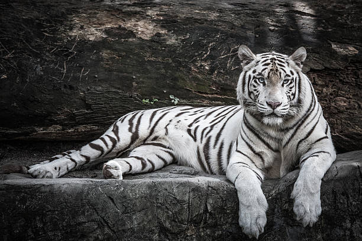

```{r setup, include=FALSE}
knitr::opts_chunk$set(echo = FALSE)
```

## About Me:

- I was born on February 17th 1997 in Kearney, Ne
- Currently working on my master's in Geography
- I love to learn about the world, I even studied abroad in Japan for a year
- I plan to graduate in the spring and pursue a career as a GIS Analyst

## Favorite Animal

- White Tiger
  - I love animals with white fur
  - I find them to be very majestic 
```{r, echo=FALSE}
   
```

## A very ugly plot

- This is an example of how not to make a plot
- The dots are too large and overlap
- There are 2 types of data being displayed that do not correspond to eachother
```{r uglyplot, echo = F, message = F, warning = F}
if (!"palmerpenguins" %in% installed.packages()) {
  remotes::install_github("allisonhorst/palmerpenguins")
}
library(palmerpenguins)
library(ggplot2)


#head(penguins)
#tail(penguins)
#penguins$species #Adelie, Gentoo, Chinstrap
#penguins$island #Biscoe, Dream, Torgersen

p <- ggplot()+
  geom_bar(data = penguins, aes(x = body_mass_g, color = island))+ #drawing the bar graph
  geom_point(data = penguins, aes(x = body_mass_g, y = bill_length_mm, color = species, size = 5))+ #drawing the scatter plot
  scale_color_manual(name = "Islands", values  = c("#57aeb2", "#77AAFF", "#0095B6", "#0892D0", "#0073E5", "#003972"))+ #setting the color for the outline
  scale_fill_manual(values = c("#57aeb2", "#77AAFF", "#0095B6", "#0892D0", "#0073E5", "#003972"))+ #setting the color for the fill
  labs(x = "Body Mass", y = "Flipper Length", title = "Penguins")+ #labeling the graph
  scale_size_continuous(guide = "none" )+ #removing size of dots from legend
  theme_dark() #changing the background color

p
```

## Link to CV:

- Here is where my link will go
